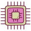

<!---
computer-ascension/computer-ascension is a ✨ special ✨ repository because its `README.md` (this file) appears on your GitHub profile.
You can click the Preview link to take a look at your changes.
--->

<h1 align = "center">🤖💻 Time To Elevate 🤖💻</h1>

 - 💻 Computer Engineer specializing in Artificial Intelligence 
 - 💞️ I’m looking to collaborate on Python Projects</li>
 - 🤖 Outworking Everyone
 - 🚁 Drone (UAV) operator in progress to obtain the FAA Drone License

<h2 align = "center">Programming</h2>

  
   
  
  
  
   
  
  
  
  
  

<h2 align = "center">Systems Expertise</h2>

  
  
  
 

<h2 align = "center">Computer Hardware</h2>

  
  
  
  
  

<strong>Note:</strong> 
<em>The techhnology specified is not linear (always learning based on projects/clients/industry needs). 
</em>

